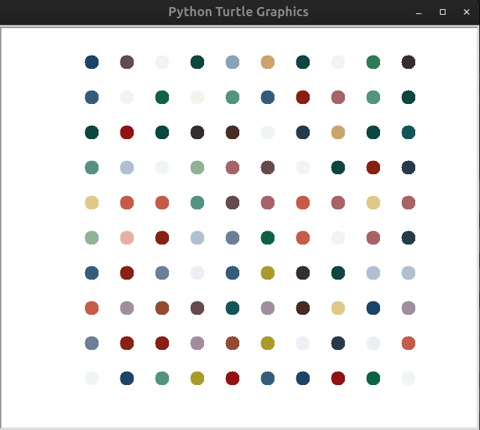

# Day_018_Hirst_Painting_Project

This project is part of my 100 Days of Code journey.

## Project Description

On Day 18, the focus was on creating a **Hirst Painting** simulation using Python's **Turtle graphics** module. This project introduced and reinforced:

- **Turtle Graphics:** Learning to control a virtual "turtle" to draw on a screen, understanding concepts like pen up/down, moving forward/backward, turning, and setting colors.
    
- **Object-Oriented Programming (OOP) with Turtle:** Interacting with `Turtle` and `Screen` objects, calling their methods, and setting their attributes.
    
- **Random Module:** Using `random.choice()` to pick random colors for the dots.
    
- **Tuples:** Representing RGB color values as tuples (e.g., `(R, G, B)`).
    
- **Color Modes:** Setting the `colormode` to 255 to use standard RGB values.
    
- **Loops:** Using nested `for` loops to create a grid-like pattern of dots.
    
- **External Libraries (Conceptual):** In a full implementation, the `colorgram` library would be used to extract dominant colors from an actual image, which would then be used in the painting. (Note: `colorgram` is not included in the provided code due to environment limitations, but a sample color list is used instead).
    

The program draws a grid of colorful dots, mimicking the style of Damien Hirst's spot paintings.

## How to Run

1. **Clone the Repository:**
    
    ```
    git clone https://github.com/Musn0o/100_days_of_code.git
    ```
    
2. **Navigate to the Project Directory:**
    
    ```
    cd 100_days_of_code/Day_018_Hirst_Painting_Project
    ```

3. **Run the Python Script:**
    
    ```
    python main.py
    ```
    

## Demo

Upon running the script, a new window will open, and a turtle will quickly draw a grid of colorful, randomly chosen dots, resembling a Hirst painting. The window will remain open until you close it or click on it (depending on the `screen.exitonclick()` behavior).



## Concepts Learned

- **Graphical Programming:** Introduction to creating visual output with Python.
    
- **OOP in Practice:** Applying OOP concepts through the `turtle` module.
    
- **Coordinate Systems:** Understanding how to position elements on a screen.
    
- **Iteration for Patterns:** Using loops to generate repetitive graphical patterns.
    
- **Color Handling:** Working with RGB color values.
## Author

[Musn0o](https://github.com/Musn0o)