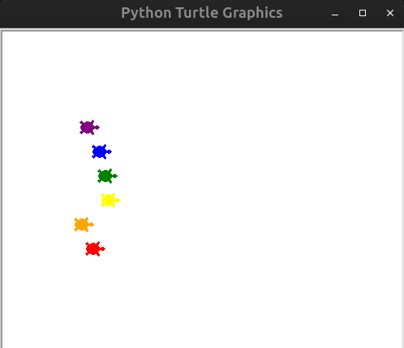

# Day_019_Turtle_Race

This project is part of my 100 Days of Code journey.

## Project Description

On Day 19, the focus was on building a **Turtle Race** game using Python's **Turtle graphics** module. This interactive project allowed me to explore and apply:

- **Multiple Turtle Objects:** Creating and controlling several independent `Turtle` instances on the same screen.
    
- **Object-Oriented Programming (OOP) with Turtle:** Further practice with `Turtle` and `Screen` objects, their attributes, and methods.
    
- **Event Listeners:** Using `screen.listen()` and `screen.onkey()` (or `onclick()`) to respond to user input (though the core race itself is random, event listeners are crucial for other turtle projects and can be adapted here for betting).
    
- **Random Movement:** Implementing `random.randint()` to simulate unpredictable movement for each turtle, making the race dynamic.
    
- **Loops:** A `while` loop to keep the race going until a winner crosses the finish line.
    
- **Conditional Statements:** Logic to determine the winner and compare it against the user's bet.
    
- **User Input (Graphical/Textual):** Taking a bet from the user on which turtle they think will win.
    

The game sets up a race track with multiple colored turtles. The user places a bet on which turtle they believe will win, and then the turtles race randomly to the finish line.

## How to Run

1. **Clone the Repository:**
    
    ```
    git clone https://github.com/Musn0o/100_days_of_code.git
    ```
    
2. **Navigate to the Project Directory:**
    
    ```
    cd 100_days_of_code/Day_019_Turtle_Race
    ```

3. **Run the Python Script:**
    
    ```
    python main.py
    ```


## Demo

Upon running the script, a new window will open displaying a race track with several colored turtles lined up at the starting point. A prompt will appear in the console asking you to place a bet on a turtle's color. After you enter your bet, the turtles will begin moving randomly across the screen. The race concludes when one turtle crosses the finish line, and the console will announce the winner and whether your bet was successful.



## Concepts Learned

- **Multi-Object Interaction:** Managing the state and behavior of multiple objects simultaneously.
    
- **Game Simulation:** Creating a basic simulation with random elements.
    
- **Graphical Positioning:** Precisely placing objects on the screen.
    
- **User Betting Logic:** Integrating user predictions into game outcomes.
    
- **Looping for Animation:** Using a loop to create continuous movement and animation.

## Author

[Musn0o](https://github.com/Musn0o)