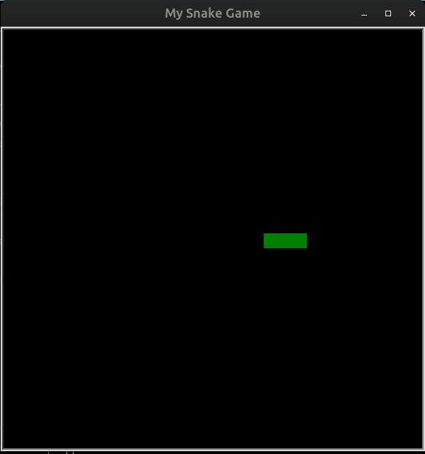

# Day_020_Snake_Game_Part_1

This project is part of my 100 Days of Code journey.

## Project Description

On Day 20, I began building the classic **Snake Game**, with this first part focusing specifically on **Animation and Coordinates**. The primary goals were to:

- **Set up the Game Screen:** Configure the `turtle` screen for the game environment.
    
- **Create the Snake Body:** Construct the snake using multiple `Turtle` objects (segments) linked together.
    
- **Implement Continuous Movement:** Make the snake move forward automatically and continuously across the screen.
    
- **Control Animation:** Utilize `screen.tracer(0)` and `screen.update()` to control when the screen refreshes, creating smooth animation.
    
- **Understand Coordinates:** Practice positioning and moving objects using X and Y coordinates.
    

This initial phase lays the groundwork for the full game, establishing the snake's visual representation and its fundamental movement mechanics.

## How to Run

This project typically involves multiple Python files (e.g., `main.py`, `snake.py`). Ensure all files are in the same directory. For this demonstration, the code is combined into a single block.

1. **Clone the Repository:**
    
    ```
    git clone https://github.com/Musn0o/100_days_of_code.git
    ```
    
2. **Navigate to the Project Directory:**
    
    ```
    cd 100_days_of_code/Day_020_Snake_Game_Part_1
    ```

3. **Run the Main Python Script:**
    
    ```
    python main.py
    ```

## Demo

Upon running the script, a black game window will appear. You will see a green snake composed of three square segments. The snake will automatically start moving forward from the center of the screen, demonstrating continuous animation.



## Concepts Learned

- **Turtle Graphics for Game Development:** Applying `turtle` beyond simple drawings to create game elements.
    
- **Multiple Turtle Objects:** Managing and coordinating the movement of several independent `Turtle` instances to form a single entity (the snake).
    
- **Screen Refresh Control:** Understanding `screen.tracer()` and `screen.update()` for smooth, flicker-free animation.
    
- **Absolute and Relative Positioning:** Moving turtles using `goto()` and `forward()`.
    
- **Game Loop:** Implementing a basic `while` loop to drive the game's continuous actions.
    
- **Basic OOP:** Encapsulating snake-related logic within a `Snake` class.
## Author

[Musn0o](https://github.com/Musn0o)