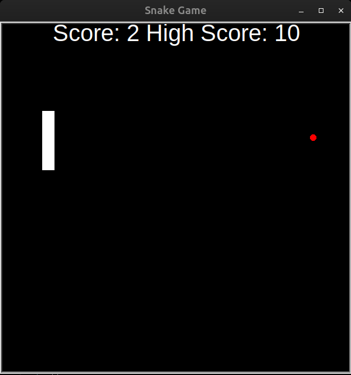

# Day_021_Snake_Game_Part_2

This project is part of my 100 Days of Code journey.

## Project Description

On Day 21, I continued developing the **Snake Game**, building upon the foundation from Day 20. This part introduced crucial game mechanics and advanced Python concepts, specifically **Inheritance and List Slicing**:

- **Food Generation:** Added a `Food` object that randomly appears on the screen.
    
- **Collision Detection (Food):** Implemented logic to detect when the snake's head collides with the food.
    
- **Snake Growth:** When the snake eats food, it extends its body.
    
- **Scoreboard:** Created a `Scoreboard` to track and display the player's score, updating it as the snake eats food.
    
- **Collision Detection (Wall):** Added game-over conditions when the snake hits the boundaries of the screen.
    
- **Collision Detection (Tail):** Implemented advanced collision detection using **List Slicing** to check if the snake's head collides with any part of its own body.
    
- **Inheritance:** Utilized inheritance by having the `Food` and `Scoreboard` classes inherit from the `Turtle` class, allowing them to leverage Turtle's drawing capabilities directly.
    

This phase transforms the basic moving snake into a fully playable game with objectives, scoring, and game-over conditions.

## How to Run

This project typically involves multiple Python files (e.g., `main.py`, `snake.py`, `food.py`, `scoreboard.py`). Ensure all files are in the same directory. For this demonstration, the code is combined into a single block.

1. **Clone the Repository:**
    
    ```
    git clone https://github.com/Musn0o/100_days_of_code.git
    ```
    
2. **Navigate to the Project Directory:**
    
    ```
    cd 100_days_of_code/Day_021_Snake_Game_Part_2
    ```

3. **Run the Main Python Script:**
    
    ```
    python main.py
    ```
 
## Demo

Upon running the script, a black game window will appear with a green snake and a red circular food item. The snake will move continuously.

- Use arrow keys (Up, Down, Left, Right) to control the snake's direction.
    
- When the snake's head touches the food, the food will disappear and reappear at a new random location, the snake will grow longer, and the score on the top of the screen will increase.
    
- The game will end if the snake hits the wall or collides with any part of its own tail, displaying "GAME OVER!".
    



## Concepts Learned

- **Inheritance:** Understanding how to create new classes that inherit properties and methods from existing classes, promoting code reuse.
    
- **List Slicing:** Efficiently accessing sub-sections of lists, particularly useful for checking tail collision without checking the head.
    
- **Collision Detection:** Implementing logic to detect interactions between game objects (snake-food, snake-wall, snake-tail).
    
- **Game State Management:** Updating score, handling game over, and resetting game elements.
    
- **Modular Game Design:** Further breaking down game components into specialized classes (`Food`, `Scoreboard`).
    
- **Continuous Input Handling:** Responding to keyboard presses to change snake direction.

## Author

[Musn0o](https://github.com/Musn0o)