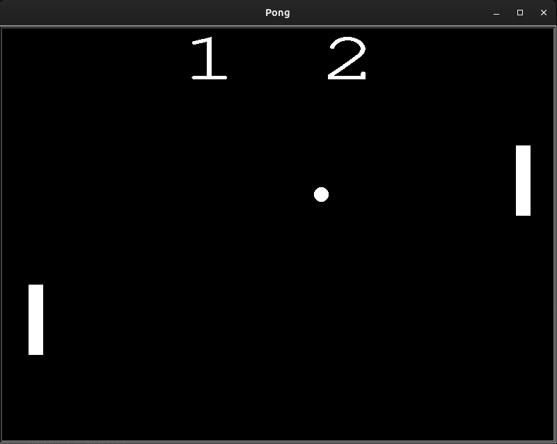

# Day_022_Pong_Game

This project is part of my 100 Days of Code journey.

## Project Description

On Day 22, I built the famous arcade game, **Pong**. This project focuses on breaking down a complex problem into smaller, manageable parts and implementing game mechanics using Python's Turtle module.

- **Paddle and Ball:** Created `Paddle` and `Ball` classes to represent the game objects.
- **Movement:** Implemented movement for the paddles and the ball.
- **Collision Detection:** Detected collisions between the ball and the walls, as well as the paddles.
- **Scoring:** Kept track of the score for each player.
- **Game Over:** The game ends when a player reaches a certain score.

## How to Run

This project involves multiple Python files (e.g., `main.py`, `paddle.py`, `ball.py`, `scoreboard.py`). Ensure all files are in the same directory.

1. **Clone the Repository:**
    
    ```
    git clone https://github.com/Musn0o/100_days_of_code.git
    ```
    
2. **Navigate to the Project Directory:**
    
    ```
    cd 100_days_of_code/Day_022_Pong_Game
    ```

3. **Run the Main Python Script:**
    
    ```
    python main.py
    ```
 
## Demo

Upon running the script, a game window will appear with two paddles and a ball.

- Use the "Up" and "Down" arrow keys to control the right paddle.
- Use the "W" and "S" keys to control the left paddle.
- The game will end when a player scores 10 points.



## Concepts Learned

- **Object-Oriented Programming (OOP):** Breaking down the game into classes for the paddle, ball, and scoreboard.
- **Game Loop:** Understanding the main loop that keeps the game running.
- **Event Handling:** Responding to keyboard input to control the paddles.
- **Collision Detection:** Implementing logic to detect collisions between game objects.
- **Game State Management:** Keeping track of the score and game-over conditions.

## Author

[Musn0o](https://github.com/Musn0o)
