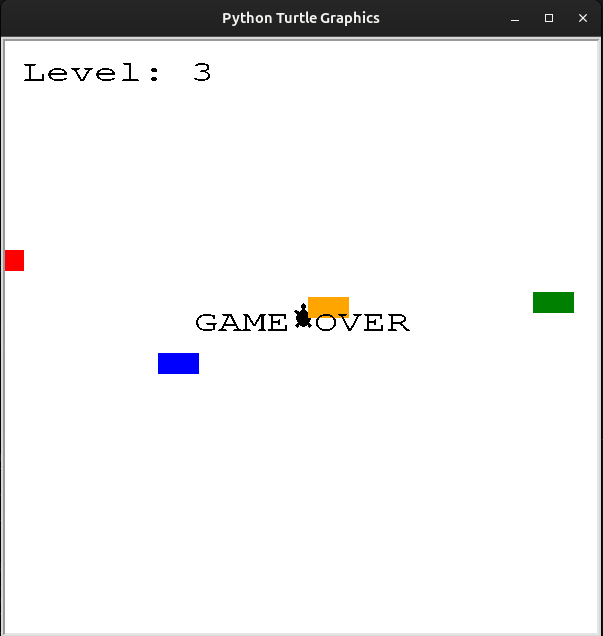

# Day_023_Turtle_Crossing_Capstone_Project

This project is part of my 100 Days of Code journey.

## Project Description

On Day 23, I built the **Turtle Crossing** game, a capstone project that combines various concepts learned so far. The objective is to guide a turtle across a busy road with moving cars and reach the other side.

- **Player Control:** The player controls a turtle that can only move forward.
- **Car Generation:** Cars are randomly generated and move from right to left across the screen.
- **Collision Detection:** The game detects when the turtle collides with a car.
- **Leveling Up:** When the turtle successfully crosses the road, the game levels up, and the cars move faster.
- **Scoring:** A scoreboard keeps track of the current level.

## How to Run

This project involves multiple Python files (e.g., `main.py`, `player.py`, `car_manager.py`, `scoreboard.py`). Ensure all files are in the same directory.

1. **Clone the Repository:**
    
    ```
    git clone https://github.com/Musn0o/100_days_of_code.git
    ```
    
2. **Navigate to the Project Directory:**
    
    ```
    cd 100_days_of_code/Day_023_Turtle_Crossing_Capstone_Project
    ```

3. **Run the Main Python Script:**
    
    ```
    python main.py
    ```
 
## Demo

Upon running the script, a game window will appear with a turtle at the bottom and cars moving across the screen.

- Use the "Up" arrow key to move the turtle forward.
- The game ends if the turtle collides with a car.
- When the turtle reaches the top of the screen, the level increases, and the cars move faster.



## Concepts Learned

- **Object-Oriented Programming (OOP):** Structuring the game with classes for the player, cars, and scoreboard.
- **Game Loop and Animation:** Creating a smooth and continuous game experience.
- **Event Handling:** Managing user input to control the player.
- **Collision Detection:** Implementing logic to handle collisions between game objects.
- **Game State and Leveling:** Managing the game's state, including leveling up and increasing difficulty.

## Author

[Musn0o](https://github.com/Musn0o)
