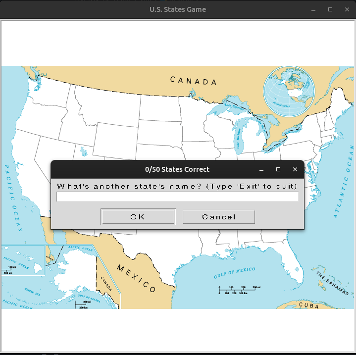

# Day_025_US_States_Game

This project is part of my 100 Days of Code journey.

## Project Description

On Day 25, I built the **U.S. States Game**, an interactive game that tests your knowledge of U.S. geography. The project utilizes the **Pandas** library to read and process data from a CSV file, and the **Turtle** library to create the game interface.

- **Map Interface:** Displays a map of the United States.
- **User Input:** Prompts the user to guess the name of a state.
- **State Recognition:** If the user guesses a state correctly, its name is written on the map at the correct location.
- **Score Tracking:** Keeps track of the number of correctly guessed states.
- **Missed States:** At the end of the game, it generates a list of the states the user missed.

## How to Run

1. **Clone the Repository:**
    
    ```
    git clone https://github.com/Musn0o/100_days_of_code.git
    ```
    
2. **Navigate to the Project Directory:**
    
    ```
    cd 100_days_of_code/Day_025_US_States_Game
    ```

3. **Install Dependencies:**
    
    ```
    pip install pandas
    ```

4. **Run the Main Python Script:**
    
    ```
    python main.py
    ```

## Demo

Upon running the script, a window with a map of the U.S. will appear. A dialog box will prompt you to enter a state name.

- If you enter a correct state name, it will be written on the map.
- The game continues until you have guessed all 50 states or you type "Exit".
- A `states_to_learn.csv` file will be created with the states you missed.




## Concepts Learned

- **Pandas Library:** Reading and processing data from CSV files.
- **Turtle Graphics:** Creating a graphical user interface (GUI) with Turtle.
- **Event Handling:** Handling user input from dialog boxes.
- **Data Manipulation:** Working with Pandas DataFrames and Series.
- **List Comprehension:** Generating lists in a concise and readable way.

## Author

[Musn0o](https://github.com/Musn0o)
