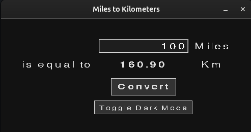

# Day_027_Kilometers_Converter

This project is part of my 100 Days of Code journey.

## Project Description

On Day 27, I built a **Miles to Kilometers Converter** using Python's **Tkinter** library. This project introduces the basics of creating graphical user interfaces (GUIs) in Python.

- **GUI Window:** Creates a simple window with labels, an entry box, and a button.
- **User Input:** Allows the user to enter a value in miles.
- **Conversion:** Converts the value from miles to kilometers when the user clicks the "Calculate" button.
- **Display Result:** Displays the converted value in a label.

## How to Run

1. **Clone the Repository:**
    
    ```
    git clone https://github.com/Musn0o/100_days_of_code.git
    ```
    
2. **Navigate to the Project Directory:**
    
    ```
    cd 100_days_of_code/Day_027_Kilometers_Converter
    ```

3. **Run the Main Python Script:**
    
    ```
    python main.py
    ```

## Demo

Upon running the script, a small window will appear. Enter a value in the input field and click "Calculate" to see the result in kilometers.



## Concepts Learned

- **Tkinter Library:** The basics of creating GUIs with Tkinter.
- **Widgets:** Using widgets like `Label`, `Entry`, and `Button`.
- **Layout Managers:** Using `grid` to arrange widgets in the window.
- **Event Handling:** Creating functions that respond to button clicks.
- **Getting User Input:** Retrieving text from an `Entry` widget.

## Author

[Musn0o](https://github.com/Musn0o)
