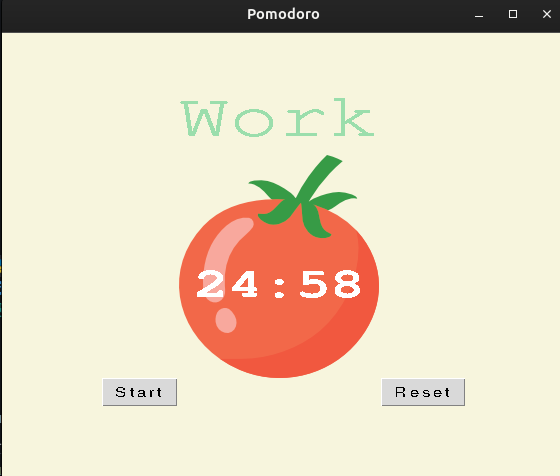

# Day_028_Pomodoro

This project is part of my 100 Days of Code journey.

## Project Description

On Day 28, I built a **Pomodoro Timer** using Python's **Tkinter** library. The Pomodoro Technique is a time management method that uses a timer to break down work into intervals, traditionally 25 minutes in length, separated by short breaks.

- **GUI Interface:** Creates a graphical user interface with a timer, start and reset buttons, and a checkmark display.
- **Timer Logic:** Implements the Pomodoro timer logic with work, short break, and long break intervals.
- **Visual Feedback:** Displays the remaining time and updates the checkmarks after each completed work session.
- **Sound Notification:** Plays a sound to notify the user when a session is complete.

## How to Run

1. **Clone the Repository:**
    
    ```
    git clone https://github.com/Musn0o/100_days_of_code.git
    ```
    
2. **Navigate to the Project Directory:**
    
    ```
    cd 100_days_of_code/Day_028_Pomodoro
    ```

3. **Run the Main Python Script:**
    
    ```
    python main.py
    ```

## Demo

Upon running the script, a window with a tomato image and a timer will appear. Click the "Start" button to begin the Pomodoro timer. The timer will cycle through work and break periods. The "Reset" button will stop the timer and reset the current state.



## Concepts Learned

- **Tkinter GUI:** Building more complex GUIs with Tkinter.
- **Canvas Widget:** Using the `Canvas` widget to display images and text.
- **Dynamic Typing:** Understanding how Python's dynamic typing works.
- **Time Management:** Using the `after()` method to schedule events in Tkinter.
- **Constants:** Using constants to make code more readable and maintainable.

## Author

[Musn0o](https://github.com/Musn0o)
