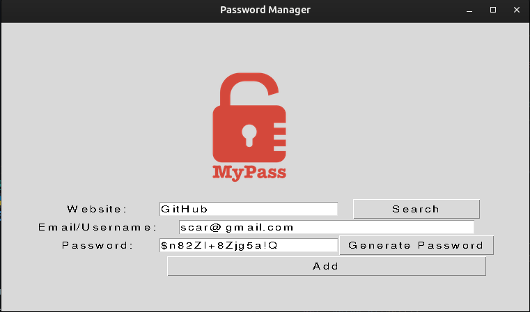

# Day_029_Password_Manager_GUI

This project is part of my 100 Days of Code journey.

## Project Description

On Day 29, I built a **Password Manager** with a graphical user interface (GUI) using Python's **Tkinter** library. This application allows users to save and retrieve passwords for different websites.

- **GUI Interface:** Creates a user-friendly interface with labels, entry fields, and buttons.
- **Password Generation:** Includes a feature to generate strong, random passwords.
- **Save Passwords:** Saves the website, email/username, and password to a file.
- **Error Handling:** Uses message boxes to display warnings and information to the user.

## How to Run

1. **Clone the Repository:**
    
    ```
    git clone https://github.com/Musn0o/100_days_of_code.git
    ```
    
2. **Navigate to the Project Directory:**
    
    ```
    cd 100_days_of_code/Day_029_Password_Manager_GUI
    ```

3. **Run the Main Python Script:**
    
    ```
    python main.py
    ```

## Demo

Upon running the script, a window with a password manager interface will appear. You can enter a website, email, and password, and then save it. The "Generate Password" button will create a random password for you.



## Concepts Learned

- **Tkinter GUI:** Advanced GUI development with Tkinter.
- **Message Boxes:** Using `messagebox` to display information, warnings, and errors.
- **File I/O:** Appending data to a file.
- **Password Generation:** Creating a random password generator.
- **Handling User Input:** Getting and validating user input from entry fields.

## Author

[Musn0o](https://github.com/Musn0o)
