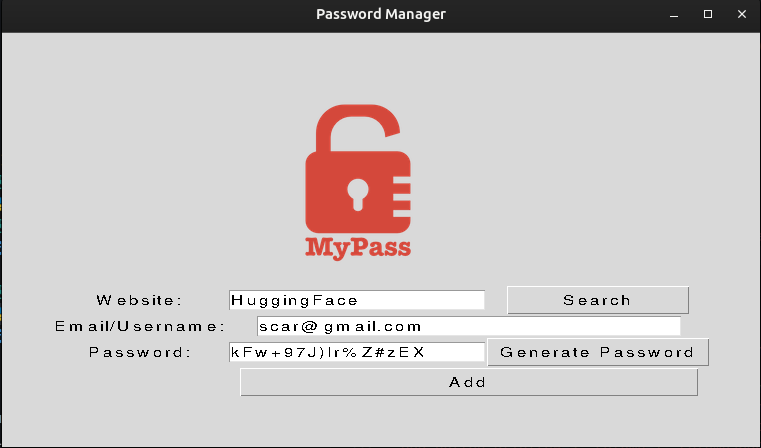

# Day_030_PW_Manager_update

This project is part of my 100 Days of Code journey.

## Project Description

On Day 30, I updated the **Password Manager** from Day 29 to include more advanced features, such as using **JSON** for data storage, improved **exception handling**, and a **search function**.

- **JSON Data Storage:** The application now saves passwords in a JSON file, which is a more structured and robust way to store data.
- **Search Functionality:** Users can now search for a website and retrieve the saved password.
- **Improved Exception Handling:** The code now includes more robust error handling to deal with cases like a missing data file or a website not being found.

## How to Run

1. **Clone the Repository:**
    
    ```
    git clone https://github.com/Musn0o/100_days_of_code.git
    ```
    
2. **Navigate to the Project Directory:**
    
    ```
    cd 100_days_of_code/Day_030_PW_Manager_update
    ```

3. **Run the Main Python Script:**
    
    ```
    python main.py
    ```

## Demo

Upon running the script, the password manager will appear. You can now save, generate, and search for passwords. The data will be stored in a `data.json` file.



## Concepts Learned

- **JSON Data:** Reading and writing JSON data.
- **Exception Handling:** Using `try`, `except`, `else`, and `finally` to handle errors gracefully.
- **Search Functionality:** Implementing a search feature to retrieve data.
- **Tkinter GUI:** Further development of the GUI to include a search button.

## Author

[Musn0o](https://github.com/Musn0o)
