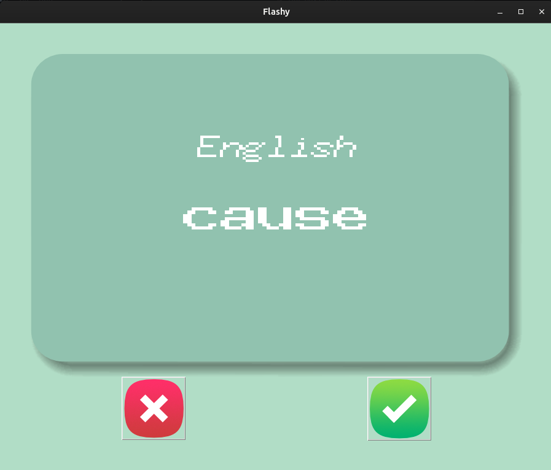

# Day_031_Flash_Card_App

This project is part of my 100 Days of Code journey.

## Project Description

On Day 31, I built a **Flash Card App** to help with language learning. This application uses **Tkinter** for the GUI, **Pandas** for data handling, and implements a spaced repetition system.

- **GUI Interface:** Displays flashcards with words in two languages.
- **Data Handling:** Reads words from a CSV file and manages known/unknown words.
- **Timer:** Automatically flips the card after a set time.
- **Spaced Repetition:** Moves known words to a separate list to focus on unknown words.

## How to Run

1. **Clone the Repository:**
    
    ```
    git clone https://github.com/Musn0o/100_days_of_code.git
    ```
    
2. **Navigate to the Project Directory:**
    
    ```
    cd 100_days_of_code/Day_031_Flash_Card_App
    ```

3. **Install Dependencies:**
    
    ```
    pip install pandas
    ```

4. **Run the Main Python Script:**
    
    ```
    python main.py
    ```

## Demo

Upon running the script, a flashcard will appear showing a French word. After 3 seconds, the card will flip to show the English translation. You can click the "✓" button if you know the word, or the "✗" button if you don't. The app will then show the next word.



## Concepts Learned

- **Tkinter GUI:** Building a more complex GUI with multiple widgets and dynamic content.
- **Pandas Library:** Reading and writing CSV files, and manipulating DataFrames.
- **`after()` method:** Scheduling functions to run after a delay.
- **Exception Handling:** Gracefully handling cases where files might not exist.
- **Spaced Repetition System:** Implementing a basic learning algorithm.

## Author

[Musn0o](https://github.com/Musn0o)
