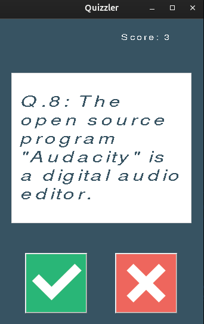

# Day_034_Quizzler_App

This project is part of my 100 Days of Code journey.

## Project Description

On Day 34, I built a **Quizzler App**, a GUI-based quiz application that fetches questions from an API and allows the user to answer true/false questions. This project integrates **Tkinter** for the UI and **requests** for API interaction, focusing on object-oriented programming principles.

- **API Integration:** Fetches true/false questions from the Open Trivia Database API.
- **GUI Interface:** Displays questions and allows users to select true or false.
- **Score Tracking:** Keeps track of the user's score.
- **Feedback:** Provides visual feedback (green for correct, red for incorrect) after each answer.
- **Question Management:** Cycles through questions and handles the end of the quiz.

## How to Run

1. **Clone the Repository:**
    
    ```
    git clone https://github.com/Musn0o/100_days_of_code.git
    ```
    
2. **Navigate to the Project Directory:**
    
    ```
    cd 100_days_of_code/Day_034_Quizzler_App
    ```

3. **Install Dependencies:**
    
    ```
    pip install requests
    ```

4. **Run the Main Python Script:**
    
    ```
    python main.py
    ```

## Demo

Upon running the script, a quiz window will appear with a question. Click the "True" or "False" button to answer. The score will update, and the card will change color to indicate if your answer was correct or incorrect.



## Concepts Learned

- **API Integration:** Making API calls to fetch data.
- **Object-Oriented Programming (OOP):** Structuring the application using classes for the quiz brain and UI.
- **Tkinter GUI:** Building a more interactive GUI with dynamic content and button commands.
- **HTML Entities:** Handling HTML entities in API responses.
- **Error Handling:** Basic error handling for API requests.

## Author

[Musn0o](https://github.com/Musn0o)
